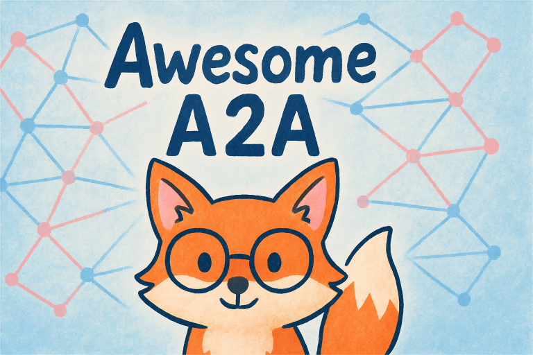

  <h2 align="center">✨ Awesome A2A (Protocolo Agent2Agent) ✨</h2>
  

    
  

  

      <a href="README.md">English</a> | <a href="README_zh.md">简体中文</a> | <a href="README_ja.md">日本語</a> | <a href="README_es.md">Español</a> | <a href="README_de.md">Deutsch</a> | <a href="README_fr.md">Français</a>
      <!-- Añade otros idiomas aquí -->
  

  

     Una lista curada de recursos, implementaciones, herramientas y ejemplos impresionantes relacionados con el Protocolo Google Agent2Agent (A2A) para la interoperabilidad de agentes de IA.
  

  <h4 align="center">
    
    <a href="CONTRIBUTING.md"> <!-- Enlace a tu archivo de contribución -->
      
    </a>
  </h4>

## Contenido

*   [🤔 ¿Qué es A2A? (Brevemente)](#-qué-es-a2a-brevemente)
*   [💡 Principios Clave](#-principios-clave)
*   [⚙️ ¿Cómo funciona A2A? (Alto Nivel)](#️-cómo-funciona-a2a-alto-nivel)
*   [🚀 Empezando con A2A](#-empezando-con-a2a)
*   [🏛️ Recursos Oficiales](#️-recursos-oficiales)
*   [📜 Especificación y Conceptos Centrales](#-especificación-y-conceptos-centrales)
*   [⚙️ Implementaciones y Bibliotecas](#️-implementaciones-y-bibliotecas)
    *   [Ejemplos Oficiales](#ejemplos-oficiales)
    *   [Integraciones de Frameworks (Ejemplos Oficiales)](#integraciones-de-frameworks-ejemplos-oficiales)
    *   [Implementaciones de la Comunidad](#implementaciones-de-la-comunidad)
        *   [SDKs y Bibliotecas (por idioma)](#sdks-y-bibliotecas-por-idioma)
        *   [Plataformas y Soluciones Integradas](#plataformas-y-soluciones-integradas)
*   [🛠️ Herramientas y Utilidades](#️-herramientas-y-utilidades)
*   [📚 Tutoriales y Artículos](#-tutoriales-y-artículos)
*   [🎬 Demos y Ejemplos](#-demos-y-ejemplos)
*   [🔗 Protocolos y Conceptos Relacionados](#-protocolos-y-conceptos-relacionados)
*   [💬 Comunidad](#-comunidad)
*   [Contribuir](#contribuir)

---

## 🤔 ¿Qué es A2A? (Brevemente)

A2A (Agent2Agent) es un **protocolo abierto** de Google y socios que permite a diferentes **agentes de IA** (de varios proveedores/frameworks) **comunicarse de forma segura** y **colaborar en tareas**. Su objetivo es romper los silos entre sistemas de agentes aislados, permitiendo una automatización más compleja entre aplicaciones.

**⭐ Sitio Web Oficial:** [google.github.io/A2A](https://google.github.io/A2A) | **⭐ GitHub Oficial:** [github.com/google/A2A](https://github.com/google/A2A) | 🌐 **Docs Multilingües (EN/ZH/JA):** [agent2agent.ren](https://agent2agent.ren)

## 💡 Principios Clave

*   **Simple:** Utiliza estándares existentes (HTTP, JSON-RPC, SSE).
*   **Listo para Empresas (Enterprise Ready):** Se enfoca en Autenticación, Seguridad, Privacidad, Monitorización.
*   **Asíncrono Primero (Async First):** Maneja tareas de larga duración y la intervención humana (human-in-the-loop).
*   **Agnóstico a la Modalidad (Modality Agnostic):** Soporta Texto, Archivos, Formularios, Streams, etc.
*   **Ejecución Opaca (Opaque Execution):** Los agentes interactúan sin compartir lógica/herramientas internas.

## ⚙️ ¿Cómo funciona A2A? (Alto Nivel)

1.  **Descubrimiento (Discovery):** Los agentes publican una `Agent Card` (JSON) describiendo capacidades, endpoint y necesidades de autenticación.
2.  **Comunicación:** Un agente `Cliente` envía una solicitud `Task` (conteniendo un `Message` con `Parts`) a un `Agente Remoto (Servidor)` usando HTTP/JSON-RPC 2.0.
3.  **Ejecución y Respuesta:** El Servidor procesa la tarea, actualizando su `status`. Responde con el estado final y cualquier `Artifact` generado (resultados, también conteniendo `Parts`).
4.  **Actualizaciones:** Para tareas largas, el Servidor puede opcionalmente transmitir `TaskStatusUpdateEvent` o `TaskArtifactUpdateEvent` vía Server-Sent Events (SSE) o usar Notificaciones Push.

*Para detalles, consulta la [Documentación Técnica Oficial](https://google-a2a.github.io/A2A/#/documentation).*

---

## 🚀 Empezando con A2A

¿Nuevo en A2A? Aquí tienes una ruta sugerida:

1.  **Entiende lo Básico:** Lee las secciones anteriores ([¿Qué es A2A?](#-qué-es-a2a-brevemente), [Principios Clave](#-principios-clave), [Cómo funciona](#️-cómo-funciona-a2a-alto-nivel)). Revisa la 📰 [Entrada del Blog del Anuncio](https://developers.googleblog.com/en/a2a-a-new-era-of-agent-interoperability/) (en inglés).
2.  **Explora Conceptos Centrales:** Sumérgete en la 📖 [Documentación Técnica Oficial](https://google-a2a.github.io/A2A/#/documentation), enfocándote en `Agent Card`, `Task`, `Message`, `Part`, y `Artifact`.
3.  **Velo en Acción:** Mira el 🎥 [Video Demo Oficial](https://storage.googleapis.com/gweb-developer-goog-blog-assets/original_videos/A2A_demo_v4.mp4) y explora el código de la 🌐 [Demo Web Multi-Agente](https://github.com/google-a2a/A2A/tree/v0.2.1/demo).
4.  **Ejecuta los Ejemplos:** Clona el [Repositorio de Ejemplos Oficial](https://github.com/google-a2a/a2a-samples) y sigue sus instrucciones para ejecutar un cliente (como el CLI) y un agente de ejemplo (ej., agente LangGraph o Genkit).
5.  **Revisa el Código:** Mira las bibliotecas `common` (Python) o `server`/`client` (JS/TS) en los ejemplos oficiales para ver cómo se implementa la comunicación A2A.
6.  **Intenta Construir:** Adapta un ejemplo o usa una biblioteca para crear tu propio agente o cliente A2A básico.

---

## 🏛️ Recursos Oficiales

*   📄 [Sitio Web del Protocolo A2A](https://google.github.io/A2A) - El sitio principal de documentación.
*   💻 [Repositorio GitHub google/A2A](https://github.com/google/A2A) - Código fuente de la especificación, documentos y ejemplos oficiales.
*   📰 [Entrada del Blog de Google Developers](https://developers.googleblog.com/en/a2a-a-new-era-of-agent-interoperability/) - Entrada del blog del anuncio explicando la motivación y los socios (en inglés).

## 📜 Especificación y Conceptos Centrales

*(Consulta [¿Cómo funciona A2A?](#️-cómo-funciona-a2a-alto-nivel) arriba para resúmenes)*

*   📖 [Documentación Técnica de A2A](https://google-a2a.github.io/A2A/#/documentation) - **(Detalles Completos)** Explicación detallada de actores, transporte, autenticación, objetos centrales (Task, Artifact, Message, Part), Agent Card, etc.
*   📄 [Especificación JSON](https://github.com/google-a2a/A2A/tree/main/specification/json) - La definición cruda del esquema JSON para las estructuras A2A.
*   💡 [Principios Clave (Docs)](https://google-a2a.github.io/A2A/#/documentation?id=key-principles) - Enlace a la sección de principios en los documentos oficiales.
*   🃏 [Especificación Agent Card (Docs)](https://google-a2a.github.io/A2A/#/documentation?id=agent-card) - Enlace a la sección de Agent Card en los documentos oficiales.
*   🗺️ [Descubrimiento de Agentes (Tema)](https://google-a2a.github.io/A2A/#/topics/agent_discovery.md) - Discusión sobre cómo los clientes pueden encontrar Agent Cards.
*   🔔 [Notificaciones Push (Tema)](https://google-a2a.github.io/A2A/#/topics/push_notifications.md) - Detalles sobre el mecanismo de notificación push.
*   🛡️ [Listo para Empresas (Tema)](https://google-a2a.github.io/A2A/#/topics/enterprise_ready.md) - Discusión sobre aspectos de seguridad, autenticación y privacidad.

## ⚙️ Implementaciones y Bibliotecas

#### Ejemplos Oficiales

*Estos demuestran la comunicación básica cliente/servidor A2A.*

| Lenguaje          | Nombre del ejemplo         | Descripción en una línea                                         | URL de GitHub                                                                                                                                                                           |
| ----------------- | -------------------------- | ---------------------------------------------------------------- | --------------------------------------------------------------------------------------------------------------------------------------------------------------------------------------- |
| 🔷 **TypeScript** | Genkit SDK Core            | TS SDK + CLI que genera código compartido front-/backend         | [https://github.com/google-a2a/a2a-samples/tree/main/samples/js](https://github.com/google-a2a/a2a-samples/tree/main/samples/js)                                                        |
|                   | Movie Recommendation Agent | Agente conversacional de recomendaciones de películas con Genkit | [https://github.com/google-a2a/a2a-samples/tree/main/samples/js/movie-agent](https://github.com/google-a2a/a2a-samples/tree/main/samples/js/movie-agent)                                |
|                   | TypeScript Client          | Ejemplo de llamada puramente frontend en TS                      | [https://github.com/google-a2a/a2a-samples/tree/main/samples/js/client](https://github.com/google-a2a/a2a-samples/tree/main/samples/js/client)                                          |
|                   | Node Express Server        | Servicio HTTP A2A con Node/Express                               | [https://github.com/google-a2a/a2a-samples/tree/main/samples/js/server](https://github.com/google-a2a/a2a-samples/tree/main/samples/js/server)                                          |
| ☕ **Java**        | Java Client Demo           | Ejemplo de cliente Java (con streaming)                          | [https://github.com/google-a2a/a2a-samples/tree/main/samples/java/client](https://github.com/google-a2a/a2a-samples/tree/main/samples/java/client)                                      |
|                   | Java Data Models           | Conjunto completo de modelos POJO del protocolo                  | [https://github.com/google-a2a/a2a-samples/tree/main/samples/java/model](https://github.com/google-a2a/a2a-samples/tree/main/samples/java/model)                                        |
|                   | Java Server Impl           | Servidor A2A con Spring Boot                                     | [https://github.com/google-a2a/a2a-samples/tree/main/samples/java/server](https://github.com/google-a2a/a2a-samples/tree/main/samples/java/server)                                      |
| 🐍 **Python**     | CLI Quickstart             | Comando de una línea para probar el bucle A2A                    | [https://github.com/google-a2a/a2a-samples/tree/main/samples](https://github.com/google-a2a/a2a-samples/tree/main/samples)                                                              |
|                   | Host Agent Service         | Servicio de entrada que aloja y despacha agentes                 | [https://github.com/google-a2a/a2a-samples/tree/main/samples/host\_agent](https://github.com/google-a2a/a2a-samples/tree/main/samples/host_agent)                                       |
|                   | Weather Agent              | Agente de clima + servidor HTTP                                  | [https://github.com/google-a2a/a2a-samples/tree/main/samples/weather\_agent](https://github.com/google-a2a/a2a-samples/tree/main/samples/weather_agent)                                 |
|                   | Minimal MCP                | Protocolo de coordinación multi-agente sin framework             | [https://github.com/google-a2a/a2a-samples/tree/main/samples/a2a-mcp-without-framework](https://github.com/google-a2a/a2a-samples/tree/main/samples/a2a-mcp-without-framework)          |
|                   | Travel Agency Agents       | Colaboración multi-agente en escenario de agencia de viajes      | [https://github.com/google-a2a/a2a-samples/tree/main/samples/python/agents](https://github.com/google-a2a/a2a-samples/tree/main/samples/python/agents)                                  |
|                   | A2A Telemetry              | Recoge y muestra telemetría de agentes                           | [https://github.com/google-a2a/a2a-samples/tree/main/samples/python/a2a\_telemetry](https://github.com/google-a2a/a2a-samples/tree/main/samples/python/a2a_telemetry)                   |
|                   | AG2 Mini-Demo              | Esqueleto mínimo de llamada A↔A                                  | [https://github.com/google-a2a/a2a-samples/tree/main/samples/python/ag2](https://github.com/google-a2a/a2a-samples/tree/main/samples/python/ag2)                                        |
|                   | Analytics Workflow         | Orquestación multi-agente para análisis de datos                 | [https://github.com/google-a2a/a2a-samples/tree/main/samples/python/analytics](https://github.com/google-a2a/a2a-samples/tree/main/samples/python/analytics)                            |
|                   | Autogen Integration        | Usa Microsoft Autogen como ejecutor                              | [https://github.com/google-a2a/a2a-samples/tree/main/samples/python/autogen](https://github.com/google-a2a/a2a-samples/tree/main/samples/python/autogen)                                |
|                   | Azure Foundry Agent        | Ejemplo con Azure AI Foundry SDK                                 | [https://github.com/google-a2a/a2a-samples/tree/main/samples/python/azureaifoundry\_sdk](https://github.com/google-a2a/a2a-samples/tree/main/samples/python/azureaifoundry_sdk)         |
|                   | Birthday Planner           | Planificador de cumpleaños multi-paso (versión ADK)              | [https://github.com/google-a2a/a2a-samples/tree/main/samples/python/birthday\_planner\_adk](https://github.com/google-a2a/a2a-samples/tree/main/samples/python/birthday_planner_adk)    |
|                   | Calendar Agent             | Lee/escribe calendario y reserva reuniones                       | [https://github.com/google-a2a/a2a-samples/tree/main/samples/python/calendar\_agent](https://github.com/google-a2a/a2a-samples/tree/main/samples/python/calendar_agent)                 |
|                   | CrewAI Collab              | Demostración de colaboración multi-rol con CrewAI                | [https://github.com/google-a2a/a2a-samples/tree/main/samples/python/crewai](https://github.com/google-a2a/a2a-samples/tree/main/samples/python/crewai)                                  |
|                   | Google ADK Demo            | Demo mínima oficial de Google ADK                                | [https://github.com/google-a2a/a2a-samples/tree/main/samples/python/google\_adk](https://github.com/google-a2a/a2a-samples/tree/main/samples/python/google_adk)                         |
|                   | Headless OAuth2            | Flujo OAuth2 para agentes sin interfaz                           | [https://github.com/google-a2a/a2a-samples/tree/main/samples/python/headless\_agent\_auth](https://github.com/google-a2a/a2a-samples/tree/main/samples/python/headless_agent_auth)      |
|                   | Hello World                | Andamiaje “Hello World” recomendado para empezar                 | [https://github.com/google-a2a/a2a-samples/tree/main/samples/python/helloworld](https://github.com/google-a2a/a2a-samples/tree/main/samples/python/helloworld)                          |
|                   | LangGraph Dialogue         | Diálogo multi-turno con LangGraph                                | [https://github.com/google-a2a/a2a-samples/tree/main/samples/python/langgraph](https://github.com/google-a2a/a2a-samples/tree/main/samples/python/langgraph)                            |
|                   | LlamaIndex File QA         | Búsqueda de preguntas y respuestas sobre archivos locales        | [https://github.com/google-a2a/a2a-samples/tree/main/samples/python/llama\_index\_file\_chat](https://github.com/google-a2a/a2a-samples/tree/main/samples/python/llama_index_file_chat) |
|                   | Marvin Integration         | Agentes de dominio con integración Marvin                        | [https://github.com/google-a2a/a2a-samples/tree/main/samples/python/marvin](https://github.com/google-a2a/a2a-samples/tree/main/samples/python/marvin)                                  |
|                   | MindsDB Predictor          | Predicción y consulta mediante MindsDB                           | [https://github.com/google-a2a/a2a-samples/tree/main/samples/python/mindsdb](https://github.com/google-a2a/a2a-samples/tree/main/samples/python/mindsdb)                                |
|                   | Semantic Kernel Orch       | Orquestación con Semantic Kernel                                 | [https://github.com/google-a2a/a2a-samples/tree/main/samples/python/semantickernel](https://github.com/google-a2a/a2a-samples/tree/main/samples/python/semantickernel)                  |
|                   | Travel Planner             | Agente integral de planificación de viajes                       | [https://github.com/google-a2a/a2a-samples/tree/main/samples/python/travel\_planner\_agent](https://github.com/google-a2a/a2a-samples/tree/main/samples/python/travel_planner_agent)    |
|                   | Veo Video Generator        | Generación automática de video con Veo API                       | [https://github.com/google-a2a/a2a-samples/tree/main/samples/python/veo\_video\_gen](https://github.com/google-a2a/a2a-samples/tree/main/samples/python/veo_video_gen)                  |
|                   | Host Push Listener         | Escucha push en host y distribuye tareas                         | [https://github.com/google-a2a/a2a-samples/tree/main/samples/python/hosts](https://github.com/google-a2a/a2a-samples/tree/main/samples/python/hosts)                                    |
|                   | Multi-Agent Orchestration  | Ejemplo integral de invocación remota y cooperación              | [https://github.com/google-a2a/a2a-samples/tree/main/samples/python/multiagent](https://github.com/google-a2a/a2a-samples/tree/main/samples/python/multiagent)                          |
|                   | Common Utilities           | Biblioteca común de utilidades (parsing de tarjetas, wrappers)   | [https://github.com/google-a2a/a2a-samples/tree/main/samples/python/common](https://github.com/google-a2a/a2a-samples/tree/main/samples/python/common)                                  |
|                   | Reference Server           | Servidor de referencia en Python + gestión de tareas             | [https://github.com/google-a2a/a2a-samples/tree/main/samples/python/server](https://github.com/google-a2a/a2a-samples/tree/main/samples/python/server)                                  |
|                   | Helper Scripts             | Scripts genéricos para auth push, etc.                           | [https://github.com/google-a2a/a2a-samples/tree/main/samples/python/utils](https://github.com/google-a2a/a2a-samples/tree/main/samples/python/utils)                                    |
| 🐹 **Go**         | Go Reference Impl          | Servidor + cliente A2A completo en Go                            | [https://github.com/google-a2a/a2a-samples/tree/main/samples/go](https://github.com/google-a2a/a2a-samples/tree/main/samples/go)                                                        |

> **Inicio rápido**
> Para empezar prueba **TypeScript `Movie Recommendation Agent`**, **Python `Hello World`** o **Go `Go Reference Impl`**: mínimas dependencias y arranque sencillísimo.

#### Integraciones de Frameworks (Ejemplos Oficiales)

*Estos muestran cómo los agentes construidos con frameworks específicos pueden exponer una interfaz A2A.*

| Idioma     | Framework de Agente | Descripción del Agente                 | Características Clave de A2A Demostradas | Enlace                                                                           |
| :--------- | :------------------ | :--------------------------------------- | :--------------------------------------- | :----------------------------------------------------------------------------- |
| 🐍 Python  | LangGraph           | Conversión de moneda                   | Herramientas, Streaming, Multi-turno     | [Enlace](https://github.com/google-a2a/A2A/tree/v0.2.1/samples/python/agents/langgraph) |
| 🐍 Python  | CrewAI              | Generación de imágenes                 | Artefactos no textuales (Archivos)     | [Enlace](https://github.com/google-a2a/A2A/tree/v0.2.1/samples/python/agents/crewai)   |
| 🐍 Python  | Google ADK          | Reembolso de gastos                    | Multi-turno, Formularios (DataPart)    | [Enlace](https://github.com/google-a2a/A2A/tree/v0.2.1/samples/python/agents/google_adk)|
| 🚀 JS/TS   | Genkit              | Info de películas / Generación de código | Herramientas, Artefactos (Archivos), Async | [Enlace](https://github.com/google-a2a/A2A/tree/v0.2.1/samples/js/src/agents)          |

#### Implementaciones de la Comunidad

##### SDKs y Bibliotecas (por idioma)

*   **Go**
    *   🌟 [trpc-a2a-go](https://github.com/trpc-group/trpc-a2a-go) por [@trpc-group](https://github.com/trpc-group)  - Implementación A2A en Go desarrollada por el equipo tRPC, ofrece soporte completo de cliente/servidor, gestión de tareas en memoria, respuestas en streaming, gestión de sesiones y múltiples métodos de autenticación (JWT, clave API, OAuth2). Incluye ejemplos completos de servidor básico, streaming e implementaciones de autenticación.
    *   🌟 [a2a-go](https://github.com/a2aserver/a2a-go) por [@a2aserver](https://github.com/a2aserver)  - Una biblioteca Go para construir servidores A2A, con implementaciones de ejemplo.
*   **Rust**
    *   🌟 [a2a-rs](https://github.com/EmilLindfors/a2a-rs) por [@EmilLindfors](https://github.com/EmilLindfors)  - Una implementación idiomática en Rust que sigue los principios de la arquitectura hexagonal.
    *   🌟 [Agentic](https://github.com/jeremychone/rust-agentic) by [@jeremychone](https://github.com/jeremychone)  - Una crate de Rust que proporciona bloques de construcción esenciales para aplicaciones agénticas, con una API ergonómica para soporte de MCP y A2A. (En desarrollo)
*   **Python**
    *   🌟 [a2a-python](https://github.com/google/a2a-python) por [@google](https://github.com/google)  - SDK Python **oficial** para ejecutar aplicaciones agénticas como servidores A2A siguiendo el protocolo Agent2Agent.
    *   🌟 [a2a_min](https://github.com/pcingola/a2a_min) por [@pcingola](https://github.com/pcingola)  - Un SDK minimalista de Python para la comunicación A2A.
    *   🌟 [python-a2a](https://github.com/themanojdesai/python-a2a) by [@themanojdesai](https://github.com/themanojdesai)  - Una biblioteca Python fácil de usar para implementar el protocolo A2A.
    *   🌟 [A2AServer](https://github.com/johnson7788/A2AServer) by [@johnson7788](https://github.com/johnson7788)  - Un framework de servidor Python que implementa el protocolo A2A de Google con integración MCP.
*   **C#/.NET**
    *   🌟 [a2adotnet](https://github.com/azixaka/a2adotnet) por [@azixaka](https://github.com/azixaka)  - Una implementación en C#/.NET del protocolo A2A.
    *   🌟 [a2a-net](https://github.com/neuroglia-io/a2a-net) por [@neuroglia-io](https://github.com/neuroglia-io)  - Implementación .NET del protocolo Agent2Agent (A2A) para permitir la comunicación segura e interoperable entre agentes autónomos a través de frameworks y proveedores.
*   **JavaScript/TypeScript**
    *   🌟 [nestjs-a2a](https://github.com/thestupd/nestjs-a2a) por [@thestupd](https://github.com/thestupd)  - Un módulo para integrar el protocolo A2A en aplicaciones NestJS.
    *   🌟 [Artinet SDK](https://github.com/the-artinet-project/artinet-sdk) by [@the-artinet-project](https://github.com/the-artinet-project)  - Servidor/cliente A2A compatible con TypeScript (Node.js) que simplifica la creación de agentes IA interoperables, enfocado en DX y preparación para producción.
*   **Java**
    *   🌟 [a2ajava](https://github.com/vishalmysore/a2ajava) by [@vishalmysore](https://github.com/vishalmysore)  - Java A2A server/client implementation using Spring Boot with annotations. Supports WebSockets, MCP integration, and includes enterprise/Kubernetes deployment tutorials.

##### Plataformas y Soluciones Integradas

*   🌟 [Elkar](https://github.com/elkar-ai/elkar-a2a) by [@elkar-ai](https://github.com/elkar-ai)  - Una capa de gestión de tareas de código abierto para agentes de IA, basada en el Protocolo Agent2Agent (A2A) de Google. Envíe, rastree y orqueste tareas entre agentes de IA, sin esfuerzo.
*   🌟 [Aira](https://github.com/IhateCreatingUserNames2/Aira) by [@IhateCreatingUserNames2](https://github.com/IhateCreatingUserNames2)  - Una implementación de red A2A para alojar, registrar, descubrir e interactuar con agentes. Incluye mecanismos de descubrimiento de agentes.
*   🌟 [Cognisphere](https://github.com/IhateCreatingUserNames2/Cognisphere) by [@IhateCreatingUserNames2](https://github.com/IhateCreatingUserNames2)  - Un framework de desarrollo de agentes de IA construido sobre el ADK de Google, facilitando la creación de agentes potencialmente para redes A2A.
*   🌐 [Grasp](https://github.com/aircodelabs/grasp) by [@adcentury](https://github.com/adcentury)  - Un agente de navegador autoalojado con soporte nativo para MCP y A2A.
*   🌟 [swissknife](https://github.com/daltonnyx/swissknife) by [@daltonnyx](https://github.com/daltonnyx)  - Una aplicación de chat multiagente con soporte MCP, con el objetivo de exponer agentes a través del protocolo A2A y conectarse a agentes A2A remotos como cliente.
<!-- ¡Añade la tuya aquí! Consulta CONTRIBUTING.md -->

## 🛠️ Herramientas y Utilidades

Esta sección tiene como objetivo listar herramientas y utilidades independientes relacionadas con el protocolo A2A. El ecosistema aún está en desarrollo, ¡y las contribuciones de la comunidad son bienvenidas!

*   **Servicios de Descubrimiento de Agentes**
    *   Algunas implementaciones a nivel de plataforma (como [Aira](https://github.com/IhateCreatingUserNames2/Aira)) incluyen mecanismos de registro y descubrimiento de agentes dentro de sus características.
    *   *Contribuciones de la comunidad bienvenidas: Implementaciones de servicios de directorio de agentes independientes, motores de búsqueda de Agent Cards, etc.* <!-- TODO: Se aceptan contribuciones de la comunidad para herramientas relacionadas -->
*   **Herramienta de Validación A2A**
    *   ⚙️ [A2A Validation Tool](https://github.com/llmx-de/a2a-validation-tool) by [@llmx-de](https://github.com/llmx-de)  - Aplicación de escritorio multiplataforma para probar y validar implementaciones del protocolo A2A, con funciones como conexión multiagente y gestión de sesiones.
    *   *Contribuciones de la comunidad bienvenidas: Validadores en línea o de línea de comandos para verificar si las estructuras de Agent Card, Task/Artifact cumplen con las especificaciones JSON Schema de A2A, o plugins para IDEs, etc.* <!-- TODO: Se aceptan contribuciones de la comunidad para herramientas relacionadas -->
*   **Adaptadores de Monitorización/Trazabilidad**
    *   *Contribuciones de la comunidad bienvenidas: Adaptadores o bibliotecas para integrar datos de flujo de tareas A2A en plataformas de monitorización convencionales como OpenTelemetry, Prometheus, Grafana, etc.* <!-- TODO: Se aceptan contribuciones de la comunidad para herramientas relacionadas -->
*   **Otras Utilidades**
    *   *Contribuciones de la comunidad bienvenidas: por ejemplo, herramientas de ayuda para la construcción de mensajes A2A, generadores de Agent Cards, Mock A2A Server/Client, etc.* <!-- TODO: Se aceptan contribuciones de la comunidad para herramientas relacionadas -->
    *   🌟 [autoa2a](https://github.com/NapthaAI/autoa2a) by [NapthaAI](https://github.com/NapthaAI)  - Convierte fácilmente agentes y orquestadores de frameworks de agentes existentes a servidores A2A.

## 📚 Tutoriales y Artículos

*   📄 [Descripción Conceptual Oficial de A2A (README)](https://github.com/google/A2A#conceptual-overview) - Explicación de alto nivel en el README del repo oficial.
*   🚀 [Guía de Inicio Rápido (README Oficial)](https://github.com/google/A2A#getting-started) - Enlaces a documentos, especificaciones, ejemplos en el README del repo oficial.
*   🌐 [Sitio de Documentación del Protocolo Agent2Agent](https://agent2agent.ren) - Sitio de documentación de código abierto impulsado por la comunidad para el protocolo A2A. Construido con React/TypeScript, soporta inglés, chino y japonés. ([Código Fuente](https://github.com/ai-boost/agent2agent_doc))
*   📄 [A Survey of AI Agent Protocols](https://arxiv.org/pdf/2504.16736) - Artículo académico que examina los protocolos de comunicación existentes para agentes LLM (incluida la categoría a la que pertenece A2A), clasificándolos, analizando su rendimiento y discutiendo desafíos futuros.
*   📚 [Tutorial de A2A y MCP](https://github.com/Tsadoq/a2a-mcp-tutorial) por [@Tsadoq](https://github.com/Tsadoq)  - Un tutorial sobre cómo usar el Model Context Protocol de Anthropic y el Agent2Agent Protocol de Google.

## 🎬 Demos y Ejemplos

*   🌐 [Demo Web Multi-Agente Oficial (Python/Mesop)](https://github.com/google-a2a/A2A/tree/v0.2.1/demo) - Demuestra el agente orquestador interactuando con múltiples agentes remotos, renderizando texto, imágenes y formularios. **Requiere ejecutar código Python.**
*   🎥 [Video Demo Oficial (Enlace de Sección)](https://github.com/google/A2A#see-a2a-in-action) - Enlace al video incrustado en el README del repositorio oficial.
*   💻 [Agent2Agent (A2A) Samples](https://github.com/google-a2a/a2a-samples) by [@google-a2a](https://github.com/google-a2a)  - Repositorio oficial que contiene ejemplos de código y demos que utilizan el Protocolo Agent2Agent (A2A).

## 🔗 Protocolos y Conceptos Relacionados

*   📦 [Model Context Protocol (MCP)](https://github.com/modelcontextprotocol/servers) - Protocolo complementario enfocado en proporcionar herramientas/contexto *a* los agentes. ([Discusión A2A y MCP](https://google-a2a.github.io/A2A/#/topics/a2a_and_mcp.md)).
*   📞 *Estándares de Llamada a Función / Uso de Herramientas* - *Contribuciones de la comunidad bienvenidas: Discusión sobre patrones, mejores prácticas o estándares relevantes para la llamada a funciones/uso de herramientas en conjunto con A2A.* <!-- TODO: Se aceptan contribuciones de la comunidad para estándares o discusiones relacionadas -->

## 💬 Comunidad

*   🐞 [Issues GitHub de google/A2A](https://github.com/google-a2a/A2A/issues) - Para reportar bugs o sugerir mejoras al protocolo.
*   💬 [Discussions GitHub de google/A2A](https://github.com/google-a2a/A2A/discussions/) - Para preguntas generales, ideas y discusiones de la comunidad sobre el protocolo A2A.
*   🔒 [Formulario de Feedback Privado](https://docs.google.com/forms/d/e/1FAIpQLScS23OMSKnVFmYeqS2dP7dxY3eTyT7lmtGLUa8OJZfP4RTijQ/viewform) - Formulario de Google para feedback privado.

---

**¡Hagamos que Awesome A2A sea más útil juntos!**

A2A todavía es algo nuevo, y los recursos buenos o la experiencia práctica pueden estar dispersos. Creamos esta lista para reunir lo bueno en un solo lugar, facilitando la búsqueda, el aprendizaje y la consulta.

Mantener esta lista actualizada y de alta calidad depende de la ayuda de toda la comunidad:

*   ⭐ **Dale una estrella (Star)**: Si te parece útil, es una forma de apoyar y te facilita volver a encontrarla.
*   ➕ **Comparte lo que encuentres**: ¿Una buena librería, artículo, herramienta o incluso un error común (pitfall)? Añádelo mediante un [Issue](https://github.com/ai-boost/awesome-a2a/issues) o [PR](CONTRIBUTING.md). ¡Construyámosla juntos!
*   📣 **Corre la voz**: Hazle saber a otros amigos que estén explorando o trabajando con A2A sobre esta lista.

¡Gracias por tu interés y tus contribuciones!

---

## Contribuir

¡Las contribuciones son bienvenidas! 🙌 Por favor, lee primero las [directrices de contribución](CONTRIBUTING.md). ¡Construyamos esta lista juntos!
